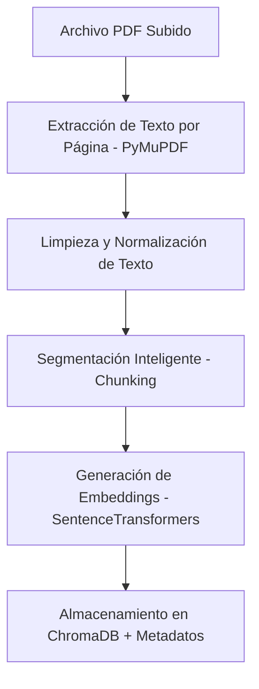

# 📚 Sistema RAG para Consulta de Archivos Académicos

Este proyecto es una aplicación web interactiva desarrollada con **Streamlit** que implementa un sistema RAG (Generación Aumentada por Recuperación) avanzado. Está diseñado específicamente para indexar, procesar y consultar de manera precisa documentos académicos en formato PDF. 

El sistema combina técnicas modernas de recuperación léxica y semántica, realiza fusión de rankings e implementa un proceso de reordenación (re-ranking) basado en similitud de coseno real antes de enviar el contexto filtrado a un modelo de lenguaje masivo (LLM) a través de la API de **Groq**. De esta forma, el asistente no solo responde preguntas complejas, sino que además cita con precisión el documento y las páginas de donde obtuvo la información.

---

## 🛠️ Stack Tecnológico y Librerías

El proyecto utiliza herramientas modernas de procesamiento de lenguaje natural y bases de datos vectoriales:

* **Streamlit (v1.38.0)**: Framework para la creación de la interfaz de usuario interactiva y el panel de estadísticas.
* **PyMuPDF / fitz (v1.24.11)**: Extracción eficiente de texto y metadatos de documentos PDF.
* **Sentence-Transformers (v3.3.0) & PyTorch (v2.6.0)**: Generación local de embeddings de alta calidad utilizando el modelo optimizado `sentence-transformers/multi-qa-mpnet-base-cos-v1`.
* **ChromaDB (v0.5.5)**: Base de datos vectorial embebida y persistente para el almacenamiento indexado de fragmentos de texto y sus vectores correspondientes.
* **Rank-BM25 (v0.2.2)**: Motor de búsqueda léxica (palabras clave) basado en el algoritmo de suavizado BM25Okapi.
* **Groq API (v0.13.0)**: Cliente para la inferencia de modelos de lenguaje de ultra-baja latencia (por defecto configurado con `openai/gpt-oss-20b` o Llama 3.1 según necesidad).
* **Python-dotenv**: Gestión de variables de entorno de configuración.

---

## 📐 Arquitectura y Pipeline RAG

La aplicación implementa una arquitectura RAG robusta dividida en tres etapas principales:

### 1. Ingesta y Procesamiento de Documentos

* **Limpieza de Texto:** Elimina ruido de extracción como saltos de línea huérfanos, espacios redundantes, caracteres no imprimibles, guiones al final de línea y números de página aislados.
* **Chunking Inteligente:** Segmenta el texto respetando los límites de los párrafos y oraciones para mantener la coherencia textual. Realiza un solapamiento (*overlap*) configurable y realiza un seguimiento dinámico de las páginas de origen (`page_start`, `page_end` y lista completa de páginas por fragmento).

### 2. Recuperación Híbrida de Información
Para garantizar una alta precisión tanto en conceptos generales como en términos técnicos específicos, el sistema realiza una **Búsqueda Híbrida**:
1. **Recuperación Semántica:** Consulta en ChromaDB los $K$ fragmentos más cercanos en el espacio vectorial.
2. **Recuperación Léxica:** Utiliza `BM25Okapi` sobre los textos tokenizados para recuperar los $K$ fragmentos con mayor coincidencia de palabras clave exactas.
3. **Fusión de Rankings (RRF):** Fusiona y normaliza los resultados semánticos y léxicos mediante **Reciprocal Rank Fusion (RRF)**:
   $$\text{RRF}(d) = \sum_{m \in M} \frac{1}{k + \text{rank}_m(d)}$$
   Donde $k = 60$ es la constante estándar y $\text{rank}_m(d)$ es la posición del documento en el ranking del recuperador $m$.

### 3. Validación, Re-Ranking y Generación
* **Re-Ranking por Similitud de Coseno:** Calcula la similitud de coseno exacta entre el embedding del prompt del usuario y el embedding de cada fragmento del conjunto recuperado:
   $$\text{Similitud Coseno}(\mathbf{u}, \mathbf{v}) = \frac{\mathbf{u} \cdot \mathbf{v}}{\|\mathbf{u}\| \|\mathbf{v}\|}$$
* **Filtrado por Umbral (Thresholding):** Descarta fragmentos que no superen el umbral mínimo de similitud, relajando este límite dinámicamente si no hay resultados cualificados.
* **Generación con Citaciones:** Formula un prompt enriquecido para el LLM en Groq. El modelo redacta la respuesta final e incluye de forma estructurada las referencias bibliográficas y páginas correspondientes.

---

## 💡 Características Principales

1. **Gestión Documental Centralizada:** Permite subir múltiples PDFs de forma simultánea. Realiza la indexación en tiempo real y ofrece la opción de eliminar archivos del sistema de forma física y del índice vectorial.
2. **Filtrado de Búsqueda Flexible:** A través de la interfaz de chat, el usuario puede elegir si desea consultar toda la biblioteca indexada o restringir la consulta a un único documento académico específico.
3. **Chatbot Inteligente con Trazabilidad:** Las respuestas del chatbot se generan únicamente con el contexto validado de los documentos e indican explícitamente las fuentes (nombre del documento y páginas exactas).
4. **Dashboard de Analíticas:** 
   * **Métricas Globales:** Total de documentos indexados, cantidad de fragmentos (chunks) y tamaño total de páginas en el sistema.
   * **Distribución de Chunks:** Gráfico interactivo que muestra cuántos fragmentos aporta cada documento a la base de conocimiento.
   * **Tabla de Metadatos:** Detalle completo de los documentos indexados (nombre, chunks generados y número de páginas).

---

## 📁 Estructura del Proyecto

```text
├── app/
│   ├── __init__.py
│   ├── dashboard.py         # Generación de métricas, dataframes y gráficos para Streamlit.
│   ├── embeddings.py        # Inicialización del codificador de Sentence-Transformers y procesamiento por lotes.
│   ├── pdf_processor.py     # Extracción con PyMuPDF, limpieza regex y chunking con control de páginas.
│   ├── rag_chain.py         # Orquestador del flujo híbrido, RRF, re-ranking de coseno y API de Groq.
│   └── vector_store.py      # Gestor de ChromaDB y construcción/búsqueda del índice BM25Okapi.
├── data/
│   ├── chroma_db/           # Base de datos local persistente de Chroma.
│   └── uploads/             # Directorio donde se almacenan los archivos PDF indexados.
├── config.py                # Variables globales, constantes de recuperación y configuración centralizada.
├── main.py                  # Punto de entrada de la interfaz de usuario en Streamlit (Chat y Dashboard).
├── requirements.txt         # Especificación de dependencias del entorno de ejecución.
└── README.md                # Documentación detallada del proyecto.
```

---

## ⚙️ Configuración de Parámetros

El archivo [`config.py`](file:///c:/Users/diego/Documents/I_SEMESTRE_4/GESTION_INFORMACION/Parcial2-RAG_Archivos_Academicos/config.py) centraliza el comportamiento del sistema. Puedes modificar las siguientes constantes de acuerdo a tus necesidades:

* **Chunking:**
  * `CHUNK_SIZE = 3000`: Tamaño máximo en caracteres de cada fragmento.
  * `CHUNK_OVERLAP = 300`: Solapamiento de caracteres entre fragmentos adyacentes.
* **Estrategia de Recuperación (Retrieval):**
  * `TOP_K_SEMANTIC = 10`: Cantidad de fragmentos recuperados vía búsqueda semántica.
  * `TOP_K_KEYWORD = 8`: Cantidad de fragmentos recuperados vía búsqueda léxica (BM25).
  * `TOP_K_FINAL = 4`: Cantidad máxima de fragmentos enviados como contexto final al LLM.
  * `SIMILARITY_THRESHOLD = 0.20`: Umbral de similitud coseno requerido.
  * `SIMILARITY_THRESHOLD_MIN = 0.08`: Límite absoluto en caso de relajar el filtro.

---

## 🚀 Instalación y Despliegue Local

### 1. Clonación del Repositorio
Clona el proyecto en tu máquina local y accede al directorio de trabajo:
```bash
git clone <URL_DEL_REPOSITORIO>
cd Parcial2-RAG_Archivos_Academicos
```

### 2. Entorno Virtual
Se recomienda utilizar un entorno virtual para aislar las dependencias:

* **En Windows (PowerShell):**
  ```powershell
  python -m venv .venv
  .venv\Scripts\Activate.ps1
  ```
* **En macOS / Linux:**
  ```bash
  python3 -m venv .venv
  source .venv/bin/activate
  ```

### 3. Instalación de Dependencias
Instala todas las librerías necesarias con el gestor de paquetes de Python:
```bash
pip install --upgrade pip
pip install -r requirements.txt
```

### 4. Variables de Envío / Entorno (`.env`)
Crea un archivo `.env` en la raíz del proyecto para almacenar tus credenciales. Asegúrate de incluir tu API Key de Groq:
```env
GROQ_API_KEY=tu_groq_api_key_aqui
CHROMA_PATH=./data/chroma_db
UPLOAD_PATH=./data/uploads
```

---

## 💻 Ejecución de la Aplicación

Para poner en marcha la aplicación web, ejecuta el siguiente comando con tu entorno virtual activo:

```bash
streamlit run main.py
```

Una vez levantado el servidor local, Streamlit indicará la URL de acceso en tu terminal (generalmente `http://localhost:8501`). Abre esta dirección en tu navegador web para interactuar con la aplicación.
